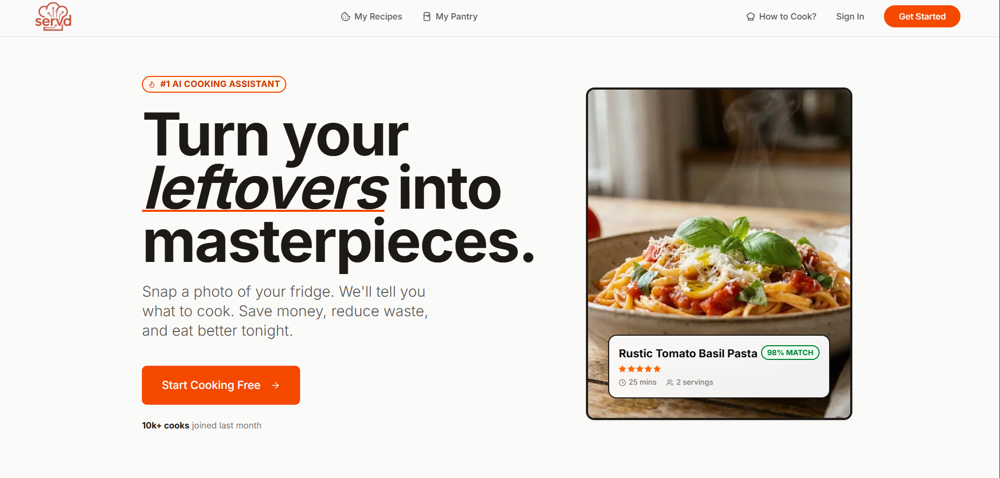

# 🍽️ Servd – AI Recipe Maker Platform





Turn your ingredients into delicious meals with AI.

Servd is a modern AI-powered recipe platform that helps users discover recipes from ingredients they already have. Simply enter ingredients or scan pantry items and let AI generate personalized recipes, cooking instructions, nutritional insights, and smart ingredient substitutions.

---

## ✨ Features

### 🤖 AI-Powered Recipe Generation

* Generate recipes from available ingredients
* Step-by-step cooking instructions
* Cuisine-based recipe recommendations
* Smart ingredient substitutions
* Chef tips and cooking suggestions

### 📸 Pantry Scanning

* Scan ingredients and discover possible dishes
* Reduce food waste by utilizing leftovers
* Personalized meal recommendations

### 🌍 Explore Recipes

* Browse recipes by categories
* Discover cuisines from around the world
* Recipe of the Day section
* Trending and featured dishes

### 📊 Nutritional Insights

* Estimated nutritional information
* Health-conscious meal recommendations
* Portion and serving suggestions

### 🔐 Authentication & Subscriptions

* Secure authentication with Clerk
* Free and Pro plans
* Premium AI features for subscribers
* Protected Pro-only content

---

## 🛠️ Tech Stack

### Frontend

* Next.js 16
* React
* Tailwind CSS
* Shadcn/UI
* Lucide React
* Clerk Authentication & Billing

### Backend

* Strapi CMS
  

### AI & APIs

* Gemini API / OpenAI (configurable)
  

---

## 🚀 Getting Started

### Clone Repository

```bash
git clone https://github.com/Prayas911/Servd.git
cd Servd
```

### Install Dependencies

#### Frontend

```bash
cd frontend
npm install
```

#### Backend

```bash
cd ../backend
npm install
```

### Environment Variables

#### Frontend (.env.local)

```env
NEXT_PUBLIC_CLERK_PUBLISHABLE_KEY=
CLERK_SECRET_KEY=
STRAPI_API_TOKEN=
NEXT_PUBLIC_STRAPI_URL=http://localhost:1337
GEMINI_API_KEY=
OPENAI_API_KEY=
```

#### Backend (.env)

```env
HOST=0.0.0.0
PORT=1337
APP_KEYS=
API_TOKEN_SALT=
ADMIN_JWT_SECRET=
TRANSFER_TOKEN_SALT=
JWT_SECRET=
ENCRYPTION_KEY=
```

### Run Development Servers

#### Backend

```bash
cd backend
npm run develop
```

#### Frontend

```bash
cd frontend
npm run dev
```

---

## 📂 Project Structure

```text
Servd
├── frontend
│   ├── app
│   ├── components
│   ├── actions
│   ├── hooks
│   ├── lib
│   └── public
└── backend
    ├── config
    ├── database
    ├── src
    └── public
```

---

## 🎯 Why Servd?

* Reduce food waste
* Save time deciding what to cook
* Discover new cuisines and dishes
* Get personalized recipes instantly
* Learn cooking with AI assistance

---

## 🔮 Future Improvements

* Voice-powered cooking assistant
* Meal planning and grocery lists
* Recipe bookmarking and collections
* Social recipe sharing
* Personalized dietary recommendations
* Multi-language support
* Recipe image generation
* AI cooking assistant chat

---

## 👨‍💻 Author

**Prayas Raghav**

Full Stack Developer passionate about building AI-powered web applications that solve real-world problems.

If you found this project helpful, consider giving it a ⭐ on GitHub.


